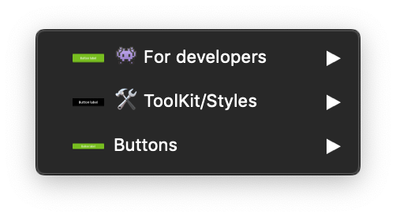

## Buttons sketch file is composed of three sections :

### **👾 For developers :**

This part is a specific section for developers, **for a better accessibility** there is all states of the LEROY MERLIN buttons :

- default
- :active
- :hover
- :focus
- :disable
- :hover:focus

### **🛠 ToolKit :**

The ToolKit section bring together the **dedicated symbols used for building the final symbols**, and you can find them in the symbol overrides.
 

**N.b :** _Actually, we just have the content with label only, but soon, contents with icons will be added in addition in this symbols._

<hint type="dont">
  <hintitem dont="true">
  Never use the toolkit symbols in your project.
  </hintitem>
</hint>

### **Buttons :**

Here is the ready-to-use symbols for your LEROY MERLIN projects, you can find **all the buttons with all the possible variations** :

- Solid or bordered
- Primary, secondary, danger or disable
- Small size, medium size or large size
