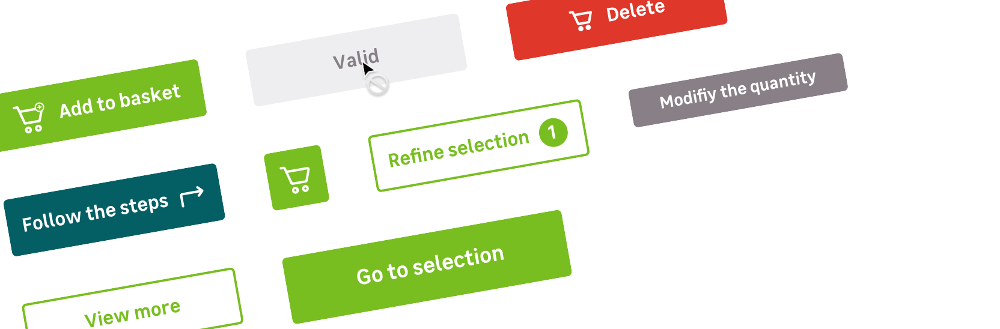

> Buttons are used to **trigger an actions**. Their appearance is depending on the type of action required from the user, or the context.

 
 

## Different variations to fit your needs

Buttons can also be the **result of various combinaisons** of :

- Sizes
- Styles
- Colors scheme

 

### Three sizes to create hierarchy

There is **3 sizes** for the buttons to create hierarchy and for a better adaptability : **Small**, **Medium** and **Large**

| Size name                   | Height       | Paddings     | Font-size |
| --------------------------- | ------------ | ------------ | --------- |
| **Small**                   | 32px (2mu)   | 16px (1mu)   | 14px      |
| **Medium** _(Default size)_ | 48px (3mu)   | 32px (2mu)   | 16px      |
| **Large**                   | 56px (3.5mu) | 40px (2.5mu) | 18px      |

 

> There may be no button width restriction following the context in which it lives.

 

### Two styles to make what's important stand out

#### Solid buttons :

Solid buttons are used to **highlight the important actions** for the user to take.
 
It is recommended to **use only one primary button** in your page or section, or see one action in your scroll level.

<pattern path="src/patterns/--button/intro"></pattern>

--- 

<hintitem>
  Use solid buttons to trigger important actions. 
  <small>For example to add a product in your basket or delete something.</small>
</hintitem>

 

#### Bordered buttons :

Bordered buttons are used to **highlight additional or optional actions**, and unlike the solid buttons, we can be use several buttons together.
 
They fit easily into an environment to lead users without being too strong.

<pattern path="src/patterns/--button/intro-bordered"></pattern>

---

<hintitem>
  Use Bordered buttons to trigger secondary actions. 
  <small>For example to see more information about a product or service.</small>
</hintitem>

  

### Four color schemes for each type of action

You can use **primary**, **secondary**, & **danger** color scheme depending of the type of action the button trigger.
There is also an alternative primary color scheme, only used for Campus : **primary-campus**.

<pattern path="src/patterns/--button/button-styles"></pattern>

| Color scheme   | Usage                                                                                     |
| -------------- | ----------------------------------------------------------------------------------------- |
| Default        | For main actions on the page or engaging actions                                          |  |
| Secondary      | For secondary or minor actions on the page                                                |
| Danger         | For buttons who the following actions is irrevocable, like deleting a product in a basket |
| Primary-Campus | For specific actions dedicated to Campus                                                  |

 

### Rules of proximity

<hint type="dont" title="Never use in proximity two solid buttons with the same color scheme">
    <pattern path="src/patterns/--button/button-proximity-dont"></pattern>
</hintitem>