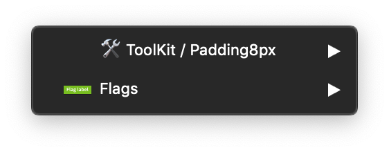
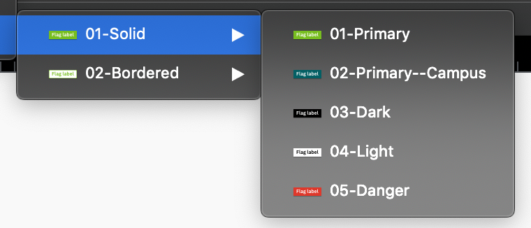

## Flags sketch file is composed of two sections :

### 🛠 ToolKit :

The ToolKit section bring together the **dedicated symbols used for building the final symbols**, and you can find them in the symbol overrides.
 

<hint type="dont">
  <hintitem dont="true">
  Never use the toolkit symbols in your project.
  </hintitem>
</hint>

### Flags :

This is the section where you will find the ready to use symbols for your projects. You can find the different variations of the flags.

- Solid
  - Primary
  - Primary--Campus
  - Dark
  - Light
  - Danger
- Bordered
  - Primary
  - Primary--Campus
  - Dark
  - Light
  - Danger
