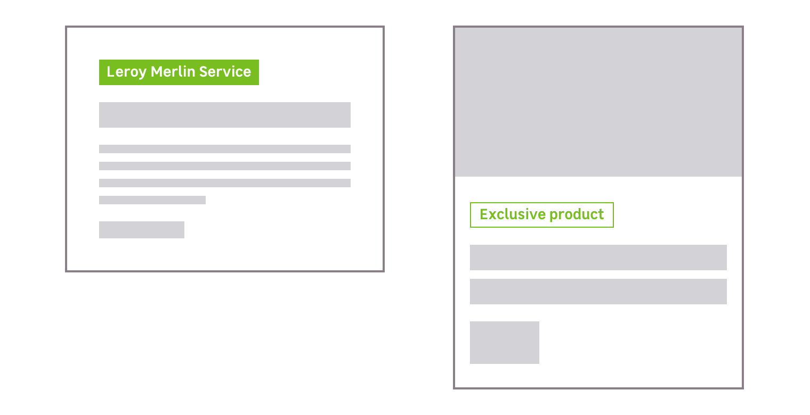
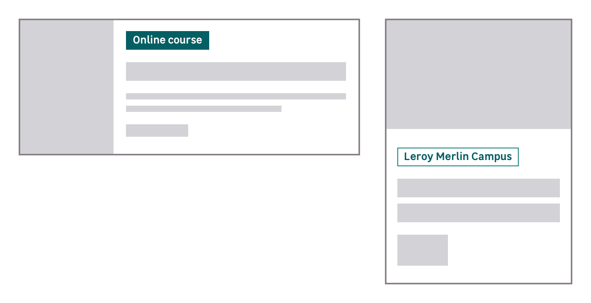
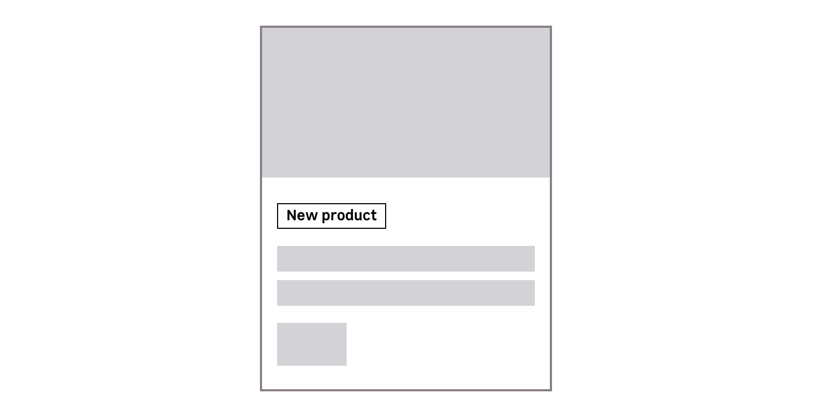
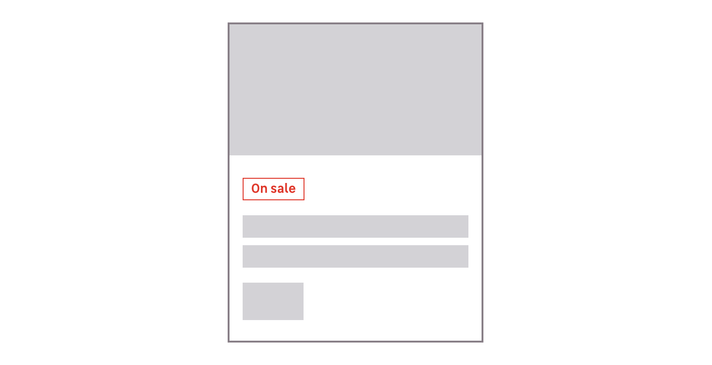

> A flag is used to display meta-informations about a product or a service. It must be displayed at the top of the content, and used as an indicator of a content main category.

Please use a [tag](/Components/Tags/) if you need to display additional information.

<preview path="src/pages/Components/Flags/previews/flag-all"></preview>

## Variations

There is different usages, depending on a color scheme.

### Primary

For display meta-informations on Leroy Merlin related content. It's used to indicate which products or services are exclusive to Leroy Merlin.

### Primary-Campus

For display meta-informations on Leroy Merlin Campus related content . For example for the DIY courses card.

### Light & Dark

Used to indicate when a product is new.

### Danger

Used for sales content, to display meta-informations about a discount on a article or a product page.

### Two styles to make what's important stand out

The styles are useful to create hierarchy, depending on your need and the constrast of the background.

- Solid
- Bordered

<preview path="src/pages/Components/Flags/previews/flag-intro"></preview>

## Do's and Dont's

<hintitem>
  Use a flag to categorize a card or a content.
</hintitem>

<hintitem dont="true">
  Never use it inside a paragraph.
</hintitem>

<hintitem dont="true">
  Never use a sentence or many words inside a flag.
</hintitem>

<hintitem dont="true">
  Never use a flag as a clickable element, to trigger an action or as a link.
</hintitem>

<hintitem dont="true">
  Never stretch a flag. Flag is never fluid, its width is depending on its content.
</hintitem>
