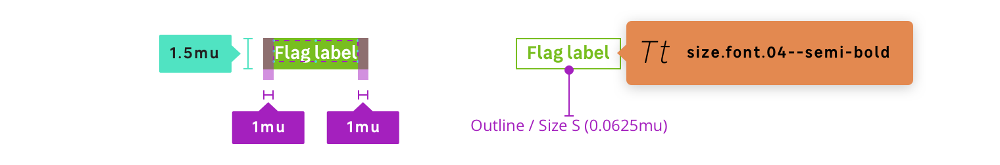

## Anatomy

## Properties

### Layout

| State       | Property  | Token                 |
| ----------- | --------- | --------------------- |
| **Default** | padding   | `$mu050` (0.5rem)     |
| **Default** | font-size | `size.font.04` (14px)  |

### Color themes

Available themes are :

- `solid`
- `bordered`
- `solid-primary-campus`
- `bordered-primary-campus`
- `solid-dark`
- `bordered-dark`
- `solid-light`
- `bordered-light`
- `solid-danger`
- `bordered-danger`

Flags states colors are defined for each theme :

| State        | Property         | Token                             |
| ------------ | ---------------- | --------------------------------- |
| **Default**  | background-color | `color.flag.[theme].background`   |
| **Default**  | border-color     | `color.flag.[theme].border`       |
| **Default**  | color            | `color.flag.[theme].font`         |
