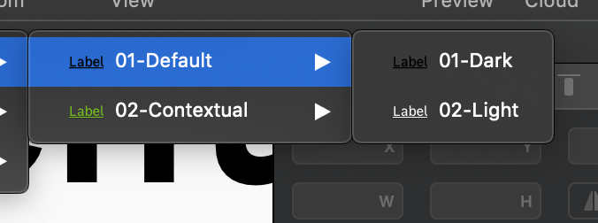

## Links sketch file is composed of three sections :

> The sketch file includes only the single links.  **For the inline links, please apply directly an underline in the text options panel.**

### **👾 For developers :**

This part describe the various states of a link, to be shared with the tech team.

### **Links :**

Here are the single links without icons. This links are available in different color schemes and two sizes : `14px` and `16px`.

### **Links+Icons :**

This section has the same configuration, but with the possibility to add an icon on the right or the left.

> **Good to know :** 
> Please, use the default links `01-Default` before thinking to any other color option, but occasionally, you can use the contextual links `02-Contextual`.

