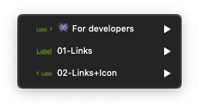

## Links sketch file is composed of three sections :

> The sketch file includes only the single links.

### **👾 For developers :**

This part is a specific section for developers, **for a better accessibility** there is all states of the Mozaic links.

### **Links :**

Here are the single links without icons. This links are available in different color schemes and two sizes : `14px` and `16px`.

### **Links+Icons :**

This section has the same configuration, but with the possibility to add an icon on the righ or the left.
