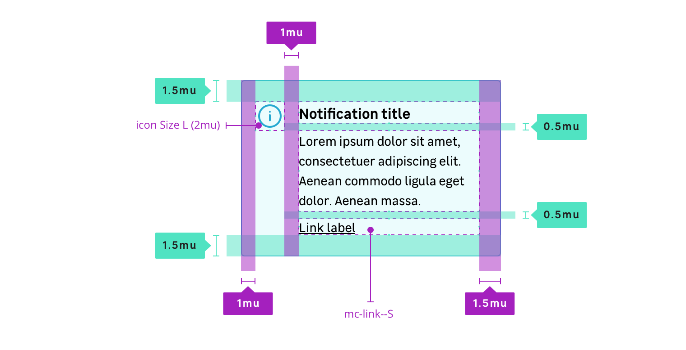

## Anatomy

## Properties

### Layout / size

| Height          | Paddings                            | Font-size                                          | radius           |
| --------------- | ----------------------------------- | -------------------------------------------------- | ---------------- |
| Depends on text | left: 64px(4mu) others: 24px(1.5mu) | `size.font.04` (14px) title: `size.font.06` (16px) | `radius.m` (4px) |

### Icon / size

| Width and height              |
| ----------------------------- |
| - Main icon 32px (2mu)        |
| - Closable icon 24px (1.5mu)  |

### States

Available states:

- `information` (default)
- `success`
- `warning`
- `danger`

Notification state colors for each state:

| State           | Property         | Token                                         |
| --------------- | ---------------- | --------------------------------------------- |
| **Information** | background-color | `color.notification.information.background`   |
| **Information** | border-color     | `color.notification.information.border`       |
| **Information** | color            | `color.notification.font`                     |
| **Success**     | background-color | `color.notification.success.background`       |
| **Success**     | border-color     | `color.notification.success.border`           |
| **Success**     | color            | `color.notification.font`                     |
| **Warning**     | background-color | `color.notification.warning.background`       |
| **Warning**     | border-color     | `color.notification.warning.border`           |
| **Warning**     | color            | `color.notification.font`                     |
| **Danger**      | background-color | `color.notification.danger.background`        |
| **Danger**      | border-color     | `color.notification.danger.border`            |
| **Danger**      | color            | `color.notification.font`                     |
