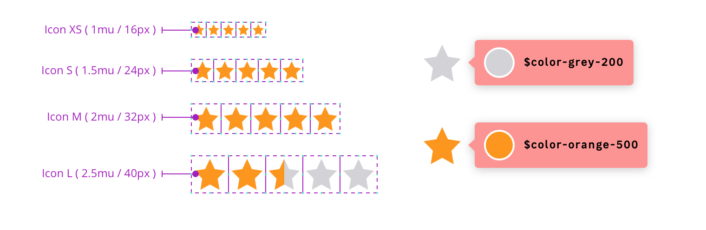

## Anatomy

<<<<<<< 51f91bdf3dda0b8cd57fd38b46acf5729f8e9200

## Properties

### Stars sizes

| Size name                   | Width and height |
| --------------------------- | ---------------- |
| **Small**                   | 16px (1mu)       |
| **Medium** _(Default size)_ | 24px (1.5mu)     |
| **Large**                   | 32px (2mu)       |
| **ExtraLarge**              | 40px (2.5mu)     |

### Colors

Three colours are used to differentiate the state of the stars:

| Star state  | Token                                                       |
| ----------- | ----------------------------------------------------------- |
| **Empty**   | `color.star.emtpy`                                          |
| **Hover**   | `color.star.hover`                                          |
| **Full**    | `color.star.full`                                           |
| **Focus**   | `color.star.focus` _(use only for the color of the border)_ |

=======
=> anatomy image

### define values

- tokens tables / properties
- schematics (with sizes margins etc)
- margins, units, styles etc
- same for responsive behaviors
>>>>>>> feat(pattern/ratingstars): add initial structure
