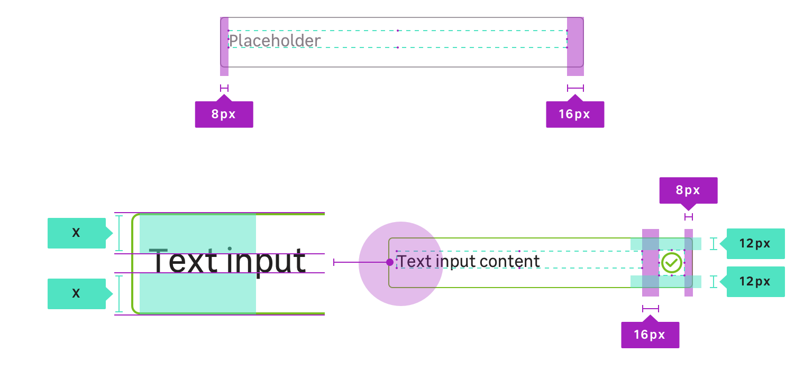

## Anatomy

## Properties

### CSS Tokens : layout

| State       | Property      | Token                |
| ----------- | ------------- | -------------------- |
| **Default** | padding       | `mu-100` (1rem)      |
| **Default** | border-radius | `radius.m` (4px)     |
| **Default** | font-size     | `size.font.05`(16px) |

### CSS Tokens : state colors

> **You must always use the tokens, the colors are only there for that information.**

| State                   | Property     | Token                              | Color   |
| ----------------------- | ------------ | ---------------------------------- | ------- |
| **Default**             | background   | `color.input.background`           | #ffffff |
| **Default**             | border-color | `color.input.border`               | #6f676c |
| **Default**             | color        | `color.input.text`                 | #222020 |
| **Hover**               | border-color | `color.input.hover.border`         | #222020 |
| **Focus**               | border-color | `color.input.focus.border`         | #25a8d0 |
| **Valid**               | border-color | `color.input.valid.border`         | #78be20 |
| **Valid** & **Hover**   | border-color | `color.input.valid.hover.border`   | #0a601b |
| **Invalid**             | border-color | `color.input.invalid.border`       | #df382b |
| **Invalid** & **Hover** | border-color | `color.input.invalid.hover.border` | #641b21 |
| **Disabled**            | background   | `color.input.disabled.background`  | #eeeef0 |
| **Disabled**            | border-color | `color.input.disabled.border`      | #a19ba2 |

**When disabled, an input field can never display any other state styles, and should not respond to any user interaction other than showing the related disabled cursor when user is overing.**

<pattern path="src/pages/Components/TextInput/previews/input-default-disabled"></pattern>

### Supported input types

<ul>
    <li><code>text</code></li>
    <li><code>email</code></li>
    <li><code>date</code></li>
    <li><code>password</code></li>
    <li><code>number</code></li>
    <li><code>tel</code></li>
    <li><code>number</code></li>
    <li><code>search</code></li>
</ul>

> Note that **if you try to apply those CSS classes to an unsupported input type**. It could work but you should find something which better suits to your needs in the documentation.
