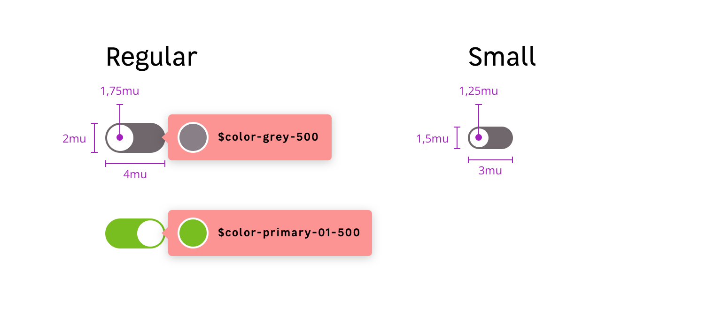

## Anatomy

## Properties

### layout

| size            | element             | Property      | Token    |
| --------------- | ------------------- | ------------- | -------- |
| **M** (Default) | background          | border-radius | `2mu`    |
| **M** (Default) | background          | width         | `4mu`    |
| **M** (Default) | background          | height        | `2mu`    |
| **M** (Default) | foreground (circle) | border-radius | `1.75mu` |
| **M** (Default) | foreground (circle) | width         | `1.75mu` |
| **M** (Default) | foreground (circle) | height        | `1.75mu` |
| **S**           | background          | border-radius | `1.5mu`  |
| **S**           | background          | width         | `3mu`    |
| **S**           | background          | height        | `1.5mu`  |
| **S**           | foreground (circle) | border-radius | `1.25mu` |
| **S**           | foreground (circle) | width         | `1.25mu` |
| **S**           | foreground (circle) | height        | `1.25mu` |

### state colors

> **You must always use the tokens, the HEX colors are only there information purpose.**

| State        | element    | Property            | Token                              | Color   |
| ------------ | ---------- | ------------------- | ---------------------------------- | ------- |
| **off**      | background | background-color    | `color.toggle.off.background`      | #887f87 |
| **off**      | circle     | background-color    | `color.toggle.off.circle`          | #ffffff |
| **on**       | background | background-color    | `color.toggle.on.background`       | #78be20 |
| **on**       | circle     | background-color    | `color.toggle.on.circle`           | #ffffff |
| **Focus**    | background | border / box-shadow | `color.input.focus.border`         | #25a8d0 |
| **Disabled** | background | background-color    | `color.toggle.disabled.background` | #eeeef0 |
| **Disabled** | circle     | background-color    | `color.toggle.disabled.circle`     | #bab6bc |

**When disabled, an input field can never display any other state styles, and should not respond to any user interaction other than showing the related disabled cursor when user is hovering.**
