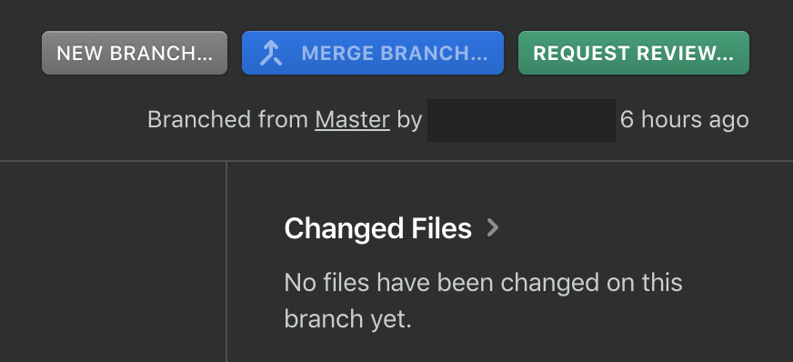
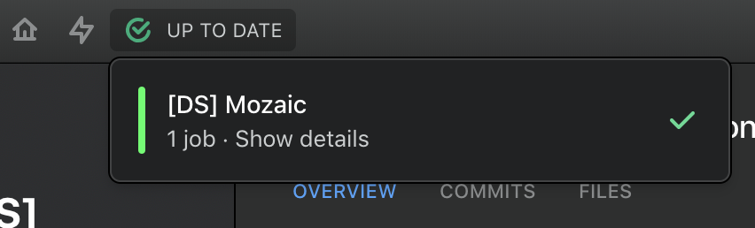

> From a designer point of view, Mozaic is based on Sketch and Abstract. Abstract is a versioning software for design files and allows teams to collaborate with a modern workflow. Like a developer does in GitHub, you need to ask for a review before merging your branches. We wrote some rules to follow before clicking **_Request Review_** on Abstract.

## 1. The symbols have been created following the [definition of Done for symbols](--link--) page.
We wrote some definition of done rules when you create some symbols in Sketch. Please read these instructions before submitting a review on Abstract. It will make the process way easier for us and we thank you for that 🤘.

## 2. Don't forget to click the `Request Review` button


## 3. Don't forget to check if Abstract is `Up to date`


## 4. Commits are meaningful
Commits are a testimony of your work on your files. Use them to make a summary of what's been done during the creation process.

## 5. Branch summary
Here is a branch summary to enter in the **Summary** section in Abstract when submitting a `Request Review`.

```## PR Checklist
Please check if your PR fulfills the following requirements:

- [ ] The commit are meaningful
- [ ] Symbols follow our [Definition of Done for Symbols](--link--)


## PR Type
What kind of behaviour and change does this branch introduces?

<!-- Please check the one that applies to this PR using "x". -->

- [ ] Style
- [ ] Simple pattern
- [ ] Complex pattern


## Other information

<!-- Feel free to add some informations that can help us to review your file -->```
