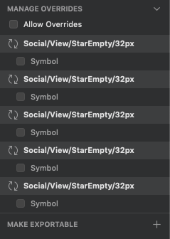

> Mozaic is a worldwide source of truth when it comes to design for Adeo and Leroy Merlin's products. That is why you need to use general guidelines when you contribute to Mozaic. We made some rules to follow when designing new symbols.

This **Definition of Done** page has been divided in 10 steps.

## 1. The pattern doesn't exist in Mozaic
I checked that the pattern is not in another library or in a current issue :
- I looked over Mozaic’s website ([Foundations](https://mozaic.adeo.cloud/Foundations/) / [Components](https://mozaic.adeo.cloud/Components/))
- I checked on GitHub ([Pull requests](https://github.com/adeo/mozaic-design-system/pulls))
- I checked on [Jira](https://design-system-adeo.atlassian.net/secure/RapidBoard.jspa?rapidView=1&projectKey=MZC&atlOrigin=eyJpIjoiYTI4ZDJhMmU2MTE1NGQyN2FmNWQxYTE3MjkzODAwMjUiLCJwIjoiaiJ9) (Issues in the kanban board)

## 2. The pattern is stored in the right file
I checked that my pattern is in the right Sketch library and it’s in somewhere that makes sense.

## 3. The naming conventions have been respected in my file
A design system needs to respond to a certain number of criterias. Naming conventions is one of the most important. It helps file organization and generates a common language.

> Here is a link where you'll find more informations about that : https://mozaic.adeo.cloud/GetStarted/Designers/namingConvention/

## 4. Every symbols are usable and responsive
Before asking for review you need to make sure that every symbol in your library is usable and responsive. Usable means that the symbol will be quickly understood by the designers. Responsive means that the symbol can be resized depending on your needs.

> Here is a tutorial to use resizing constraints in Sketch : https://www.sketch.com/docs/layer-basics/constraints/

## 5. Layer styles and text styles have been applied on the different components
We created layer and text styles to make the symbol creation process easier. Make sure to use it, the second time it will be easier that the first time 🤘. This will also make the update process way faster.

## 6. Paddings and margins use magic unit values (1mu = 16px)
Every element must use our magic unit standard which is 1 magic unit for 16 pixels.

> Here is a link where you'll find more informations about that : https://mozaic.adeo.cloud/Foundations/MagicUnit/

## 7. Every patterns coming from other libraries are up to date
Thank you for checking that every patterns are up to date (look after the “Library update” notifications in Sketch 🤓).

> Here is a link where you'll find more informations about that : https://www.sketch.com/docs/libraries/library-updates

## 8. Layers are well organized and follow our guidelines
Layers should be organized in a top to bottom reading direction to make the override process easier. For example, the header needs to be on top of the layer list and the footer on the bottom of this list. That corresponds to **top to bottom and left to right**.

## 9. Non editable elements of the symbols are not available in the override panel
When symbol elements can’t be edited you need to lock the possibility to override them. This can be done easily with Sketch when you click on the symbol’s artboard.

## 10. I followed the logic of atomic design to build my symbol

When an element is used twice, you need to create a symbol that will be usable and repeated in the final symbols. This will make the modification process faster when you need to update the component.

You can download the design kit to check how the symbols are built [here](https://github.com/adeo/design-system--styleguide/releases/download/v1.0.1-alpha.19/designer-kit.zip). Every Sketch file we produce is built the same way.
