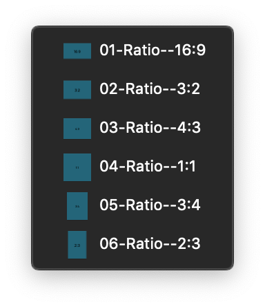

Mozaic provides an optional librairy who contained the recommended ratios for designers.

> **Good to know :** 
> You have to be precise when you use it. Be careful not to break the homothety when resizing the symbol. 
> For designers, we recommend renaming the image layers using a referenced ratio in this way : “**ImageSubject-ratio**” like "**ProductImage-1:1**” or “**ArticleImage-4:3**”. 
> It will be a great help for developers !
