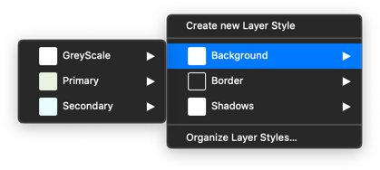

Colors are avaible in the sketch file "**[AA] GlobalStyles**".

All the colors and their variations are available as **layer styles** and they are used on backgrounds and borders with 1px or 2px ».

> **Good to know :**  
> Each color is available in a ten values scale. The default value is mentioned with the term « **—Default** ».
