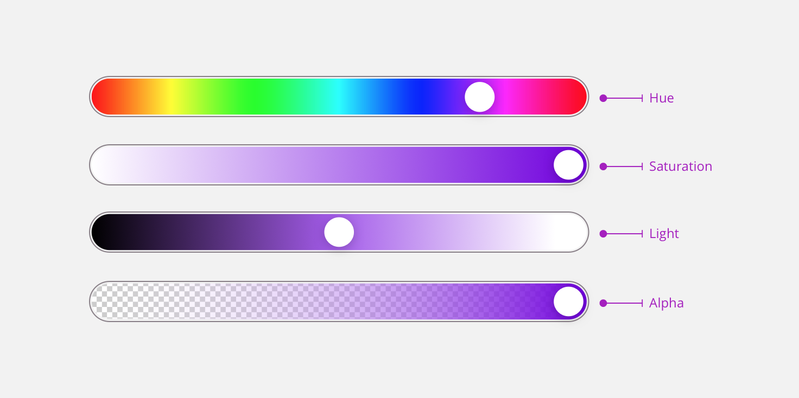

# Anatomy

In this system, every color has a dark and a light variant that can be used to adapt to most cases. The designs need to be accessible to everyone and these swatches are really helpful in this case. In order to have this flexibility we designed color swatches based on **9 values** for primary and secondary colors. It means that you can use 9 values of the same color to fit your design needs. This system allows the team to have every tint it needs to design every situation. It answers typography problems, illustration needs and it also allows to contrast with deep background colors. Here is an example showing how it works based on our Primary-01 Secondary-Purple colors.

 

In this system, every color has a dark and a light variant that can be used to adapt to most cases.

It allows the team to have every tint it needs to design every situation. It answers typography problems, illustration needs and it also allows to contrast with deep background colors.

Our colors have been defined using **HSLA color swatches**. The color pallete has been divided in three categories : **primary colors**, **secondary colors** and **greys**.

## What is HSLA ?

HSLA is a way to define colors based on three properties : **Hue**, **Saturation**, **Light** and **Alpha**. We decided to use this standard to have more consistency between colors. It is also easier to relate colors to each other when they are based on HSLA.

## Properties

To copy the variables bellow all you have to do is click on it.

### Primary

<swatch id="primary-01"></swatch>

### Grayscale

<swatch id="grey"></swatch>

# Secondary colors

## Secondary Blue

<swatch id="secondary-blue"></swatch>

## Secondary Purple

<swatch id="secondary-purple"></swatch>

## Secondary Red

<swatch id="secondary-red"></swatch>

## Secondary Orange

<swatch id="secondary-orange"></swatch>

## Secondary Yellow

<swatch id="secondary-yellow"></swatch>
