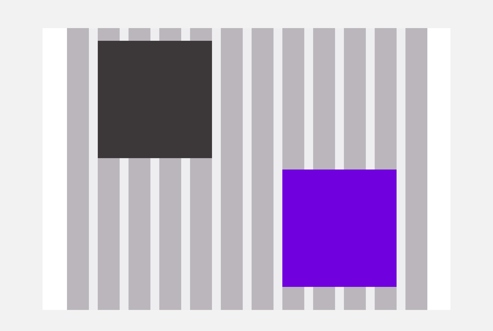

# Overview

A grid is used to create a **more structured and more harmonious design.** It’s the framework of your page, you build the layout by placing blocks of contents (text, images,…) on a certain number of columns.
Gutters are used to separate 2 blocks, they give air to the design.
Columns and gutters form a container. The container can be **full width or with a fixed size.**

### Grids can be described using the following properties :

- **column count** - the number of columns
- **gutters** - the space between columns
- **container width** - it can be either fixed (ex: 1200px) or fluid (take the available space)
- **external margins** - they create negative space between the edge of the grid and the edge of the screen

Those properties can change depending on the breakpoint.

# Principles

When using a grid, you decide the size of your elements by **the number of columns they use.**

<hintitem>
    An element should always stand on one or between several columns
</hintitem>
<hintitem>
    Elements are always separated by either a gutter or a combination of columns and gutter
</hintitem>
<hintitem dont="true">
    An element should never start on a gutter
</hintitem>

# The Leroy Merlin default Grid

We work with **12-columns grids** because the number 12 is the most versatile. 12 is divisible among reasonably small numbers; it’s possible to have 12, 6, 4, 3, 2 or 1 evenly spaced columns. This gives designers a lot of flexibility when they create a layout.

<hintitem>
    Gutters width should always be a multiple of the Magic Unit.
</hintitem>

| breakpoint                   | Cols | Container width     | Col. width   | Gutter | Margins | total width    |
| ---------------------------- | ---- | ------------------- | ------------ | ------ | ------- | -------------- |
| `s` &nbsp; (0 - 576px)       | 12   | fluid               | fluid        | 16px   | 16px    | fuild          |
| `m` &nbsp; (576px - 1100px)  | "    | fluid               | fluid        | 32px   | "       | fluid          |
| `l` &nbsp; (1100px - 1920px) | "    | fluid - max: 1280px | fluid - 80px | "      | 32px    | fluid - 1344px |
| `xl` &nbsp; (1920px and up)  | "    | 1472px              | 96px         | "      | "       | 1536px         |

TODO: choose grid sizes, columns and with the new viewports

possibles grids :

| col-size     | gutter     | external margins | container width | totalwidth    |
| ------------ | ---------- | ---------------- | --------------- | ------------- |
| 56px (3.5mu) | 16px (1mu) | 16px (1mu)       | 832px (52mu)    | 864px (54mu)  |
| 64px (4mu)   | 16px (1mu) | 16px (1mu)       | 928px (58mu)    | 960px (60mu)  |
| 72px (4.5mu) | 16px (1mu) | 16px (1mu)       | 1024px (64mu)   | 1056px (66mu) |
| 72px (4.5mu) | 16px (1mu) | 32px (2mu)       | 1024px (64mu)   | 1088px (68mu) |
| 72px (4.5mu) | 32px (2mu) | 32px (2mu)       | 1184px (74mu)   | 1248px (78mu) |
| 72px (4.5mu) | 32px (2mu) | 16px (2mu)       | 1184px (74mu)   | 1216px (76mu) |
| 80px (5mu)   | 32px (2mu) | 32px (2mu)       | 1280px (80mu)   | 1344px (84mu) |
| 88px (5.5mu) | 32px (2mu) | 32px (2mu)       | 1280px (86mu)   | 1344px (90mu) |
| 96px (6mu)   | 32px (2mu) | 32px (2mu)       | 1472px (92mu)   | 1536px (96mu) |

 
