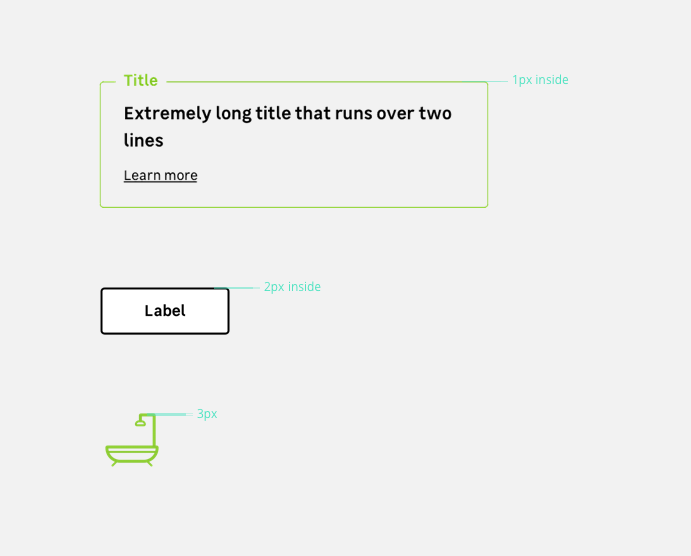

> Strokes are visual elements that space and structure contents. Different border thickness are used to create a hierarchy.

## Three available sizes

There are **three different thickness levels** :
* `s`
* `m`
* `l`

 

<hintitem>Use borders **S and M** for components.</hintitem>
<hintitem dont="true">Use border **S, M and L** for icons.</hintitem>

## Icons

Icons use different rules  
