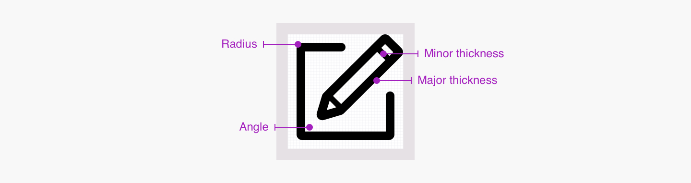

## Presentation

An icon is a graphic representation of an object, a message or a movement. It's different from an illustration because of its simplistic aspect. An **icon must be recognisable at first sight** so that the user can understand the information or the action it is intended to represent. Icons may be a visual guide to help the user to navigate on leroymerlin.fr faster. _Finally an icon can be useful when using responsive design principles because it can summarise a text content._

## Principles

#### Easy to understand
Icon's shape must be easy for the user to understand its purpose without overthinking it.

#### Abstract
Icon can represent abstract ideas. In that case, its meaning is more about the concept than reality.

#### Visible
An icon must be easy to identify in the middle of interfaces.

#### Outlined
We decided to use outlined icons to have a lighter result in our designs.

## Anatomy

## Use cases

An icon can be used in different cases on leroymerlin.fr.

#### 1. Buttons and links

Icons allows to emphasise an action et make it easier to understand. An icon can be used in a button without a label to gain space in interfaces.

#### 2. Dropdown and input

In these cases, the icon is used to guide the user in the action he needs to do. It's also a visual help about the content of the box that is going to open.

#### 3. _Quantité et défilement_

Icons can be used to change a quantity or to scroll different options. Icon use in this case is totally functional and usually results of two opposed actions.

#### 4. 
