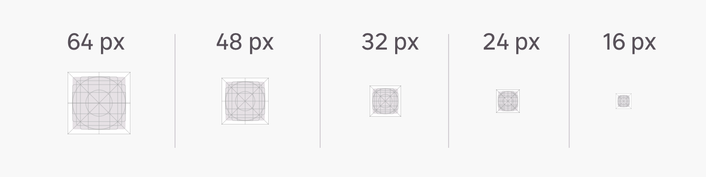
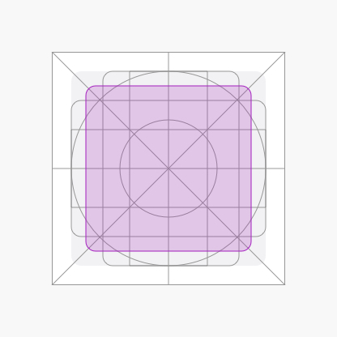
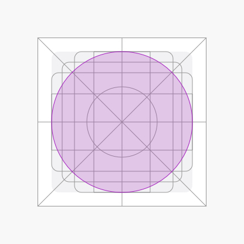
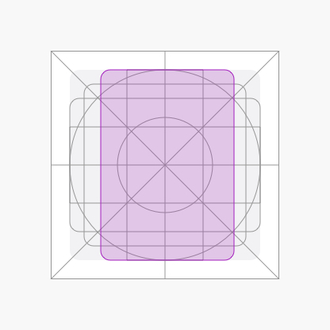

## 1. Presentation

An icon is a graphic representation of an object, a message or a movement. It's different from an illustration because of its simplistic aspect. An **icon must be recognisable at first sight** so that the user can understand the information or the action it is intended to represent. Icons may be a visual guide to help the user to navigate on leroymerlin.fr faster. _Finally an icon can be useful when using responsive design principles because it can summarise a text content._

## 2. Principles

##### Easy to understand
Icon's shape must be easy for the user to understand its purpose without overthinking it.

##### Abstract
Icon can represent abstract ideas. In that case, its meaning is more about the concept than reality.

##### Visible
An icon must be easy to identify in the middle of interfaces.

##### Outlined
We decided to use outlined icons to have a lighter result in our designs.

## 3. Anatomy

## 4. Use cases
An icon can be used in different cases on leroymerlin.fr.

##### 1. Buttons and links
Icons allows to emphasise an action et make it easier to understand. An icon can be used in a button without a label to gain space in interfaces.

##### 2. Dropdown and input
In these cases, the icon is used to guide the user in the action he needs to do. It's also a visual help about the content of the box that is going to open.

##### 3. _Quantité et défilement_
Icons can be used to change a quantity or to scroll different options. Icon use in this case is totally functional and usually results of two opposed actions.

##### 4. Close and delete
Close icons are very well know by users to close panels or delete options.

##### 5. Illustration and informative
Icons are used to illustrate what is going to detailed.

## 5. Categories
Icons library is divided in twelve categories.

| Category name                                             |
| --------------------------- | --------------------------- |
| 1. Navigation               | 7.User                      |  
| 2. Product                  | 8. Store                    |
| 3. Service                  | 9. Device                   |
| 4. Project                  | 10. Various                 |
| 5. Media                    | 11. Universe                |
| 6. Social                   | 12. Logo                    |

## 6. Structure

##### 1. Sizes
Icon sizes are **64px**, **48px**, **32px**, **24px** and **16px**. In some very particular cases a 48px can be resized to 40px. 16px icons can only be used for navigation and rating stars.

##### 2. Thickness
Leroy Merlin's icon are outlined. Thickness is very important in this style and must be followed. Every icon size has its guidelines in terms of thickness. Icon's thickness are divided in two categories : **major thickness** used to draw the outer shape of the icon and **minor thickness** to add a second level of details in the icon.

|Size       | Major thickness        | Minor thickness           | 
|-----------|------------------------|---------------------------|
| 64px      | 3px                    | 2px                       |
| 48px      | 3px                    | 2px                       |
| 32px      | 2px                    | 1px                       |
| 24px      | 2px                    | 1px                       |
| 16px      | 2px                    | 1px                       |

##### 3. Radius
Radius is only applied to the outside of an outlined path. Rounded shapes don't respond to these following rules.

|Size       | Radius                 |
|-----------|------------------------|
| 64px      | 2px                    |
| 48px      | 2px                    |
| 32px      | 2px                    |
| 24px      | 1px                    |
| 16px      | 1px                    |

#### 4. Angles
Angles must be 45° multiples.

|Angle possibilities|
|-------------------|
|45°                |
|90°                |
|135°               |
|180°               |
|225°               |
|270°               |
|315°               |
|360°               |

#### 5. Grids
The grid is a marker in the construction of the icon. It results in a consistent icon kit always using the same proportions. The grid allows the designer to design basic shapes on the same principles every time.

###### 5.1 Grid sizes
A specific grid has been designed for each size. The designed grids are : **64px**, **48px**, **32px**, **24px** and **16px**. It's important to use the correct size when using an icon in your design. For example, you can't make 200% bigger a 24px icon to have a 48px icon.

###### 5.1 Forms and shapes
The same paddings must be used around the main shape of the icon.

|| Icon size      | Width         |Height         |
|-------------------------------------------|----------------|---------------|---------------|
|                                           |64px            |46px           |46px           |
|                                           |48px            |34px           |34px           |
|                                           |32px            |22px           |22px           |
|                                           |24px            |16px           |16px           |
|                                           |16px            |10px           |10px           |

|| Icon size      | Width         |Height     |
|-------------------------------------------|----------------|---------------|---------------|
|                                           |64px            |54px           |54px           |
|                                           |48px            |40px           |40px           |
|                                           |32px            |26px           |26px           |
|                                           |24px            |20px           |20px           |
|                                           |16px            |12px           |12px           |

|| Icon size      | Width         |Height |
|-------------------------------------------|----------------|---------------|---------------|
|                                           |64px            |27px           |27px           |
|                                           |48px            |20px           |20px           |
|                                           |32px            |14px           |14px           |
|                                           |24px            |10px           |10px           |
|                                           |16px            |07px           |07px           |

|| Icon size      | Width         |Height     |
|-------------------------------------------|----------------|---------------|---------------|
|                                           |64px            |54px           |38px           |
|                                           |48px            |40px           |28px           |
|                                           |32px            |26px           |18px           |
|                                           |24px            |20px           |12px           |
|                                           |16px            |12px           |8px            |

|| Icon size      | Width         |Height     |
|-------------------------------------------|----------------|---------------|---------------|
|                                           |64px            |38px           |54px           |
|                                           |48px            |28px           |40px           |
|                                           |32px            |18px           |26px           |
|                                           |24px            |12px           |20px           |
|                                           |16px            |8px            |12px           |

|| Icon size      | Width         |Height     |
|-------------------------------------------|----------------|---------------|---------------|
|                                           |64px            |54px           |22px           |
|                                           |48px            |40px           |16px           |
|                                           |32px            |26px           |10px           |
|                                           |24px            |20px           |8px            |
|                                           |16px            |12px           |6px            |

|| Icon size      | Width         |Height     |
|-------------------------------------------|----------------|---------------|---------------|
|                                           |64px            |22px           |54px           |
|                                           |48px            |16px           |40px           |
|                                           |32px            |10px           |26px           |
|                                           |24px            |8px            |20px           |
|                                           |16px            |6px            |12px           |

#### 6. Spacings

|         |A      |B1      |B2      |B3      |
|---------|-------|--------|--------|--------|
|*64px*   |5px    |11px    |8px     |4px     |
|*48px*   |4px    |8px     |6px     |3px     |
|*32px*   |3px    |5px     |4px     |2px     |
|*24px*   |2px    |4px     |2px     |2px     |
|*16px*   |2px    |3px     |1px     |1px     |

## 6. Best practices

**Fixed size vs. variable size**
|DO                                                 |DON'T                                       |
|---------------------------------------------------|--------------------------------------------|
|                              |                   |
|An icon must be used in its original size          |An icon can't be used in another size       |

**Geometry vs. organic**
|DO                                                 |DON'T                                        |
|---------------------------------------------------|---------------------------------------------|
|                      |            |
|An icon is based on geometric shapes               |An icon is not supposed to represent reality |

**Simple icon vs. complex icon**
|DO                                                 |DON'T                                        |
|---------------------------------------------------|---------------------------------------------|
|                      |              |
|An icon must be as simple as possible              |An icon shouldn't carry too many details     |

**Outlined icon vs. filled icon**
|DO                                                 |DON'T                                                |
|---------------------------------------------------|-----------------------------------------------------|
|                        |                      |
|Leroy Merlin's icons must be outlined              |An icon in Leroy Merlin's design can't be filled     |

**Outline alignments**
|DO                                                 |DON'T                                                |
|---------------------------------------------------|-----------------------------------------------------|
|                            |                          |
|Lines must be stacked                              |An icon in Leroy Merlin's design can't be filled     |

**Opacity**
|DO                                                 |DON'T                                                |
|---------------------------------------------------|-----------------------------------------------------|
|                        |                      |
|An icon uses 100% opacity colors                   |An icon can't use an opacity under 100%              |

**Single icon vs. drawn over**
|DO                                                 |DON'T                                                |
|---------------------------------------------------|-----------------------------------------------------|
|                          |![DontSingle](DontSingle.jpg                         |
|An icon is unique                                  |An icon can't be used with another element on top    |
