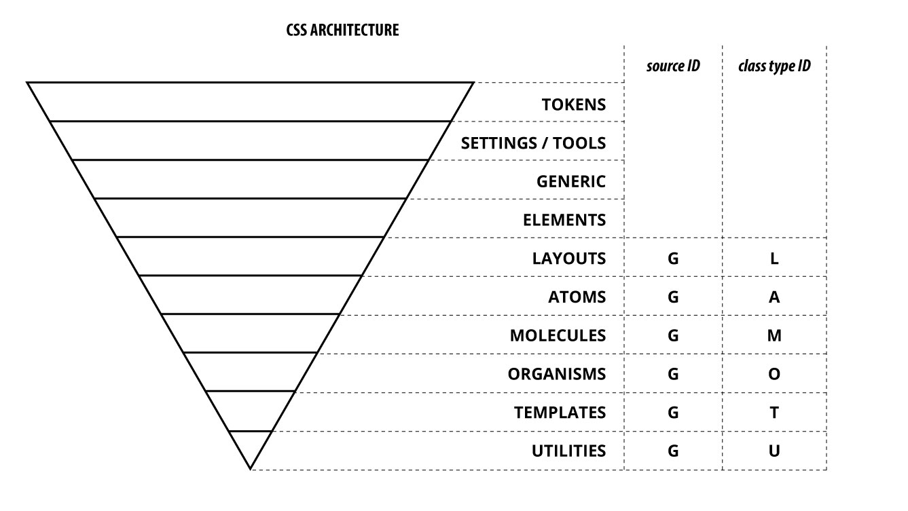

You need to create the bundle scss file (ex: `src/bundle.scss`) that you want to build.

### Import the settings/tools bundle file :

#### what's inside ?

- SCSS variables
- Mixins
- Functions

**This import is mandatory** and all the other SCSS files depend on it.

It contains also many useful tools for your own use.

Compiling a file importing only settings would output an empty file.

```scss
// mandatory
@import '../node_modules/@mozaic-ds/styles/settings-tools/_all-settings';
```

<br>

### Import garden SCSS files :

It is important that you follow our ITCSS/ADS [import order](https://gael-boyenval.gitbook.io/atomic-design-css-architecture-with-itcss-bem-sass/principles/unifying-itcss-with-ads#summarize-the-new-architecture):



The import order within the same ITCSS category does not matter.

```scss
// mandatory
@import '../node_modules/@mozaic-ds/styles/settings-tools/_all-settings';

// Generics
@import '../node_modules/@mozaic-ds/styles/generics/_g.***.scss';
@import '../node_modules/@mozaic-ds/styles/generics/_g.***.scss';

// Elements
@import '../node_modules/@mozaic-ds/styles/elements/_e.***.scss';
@import '../node_modules/@mozaic-ds/styles/elements/_e.***.scss';

/*... etc ...*/
```
