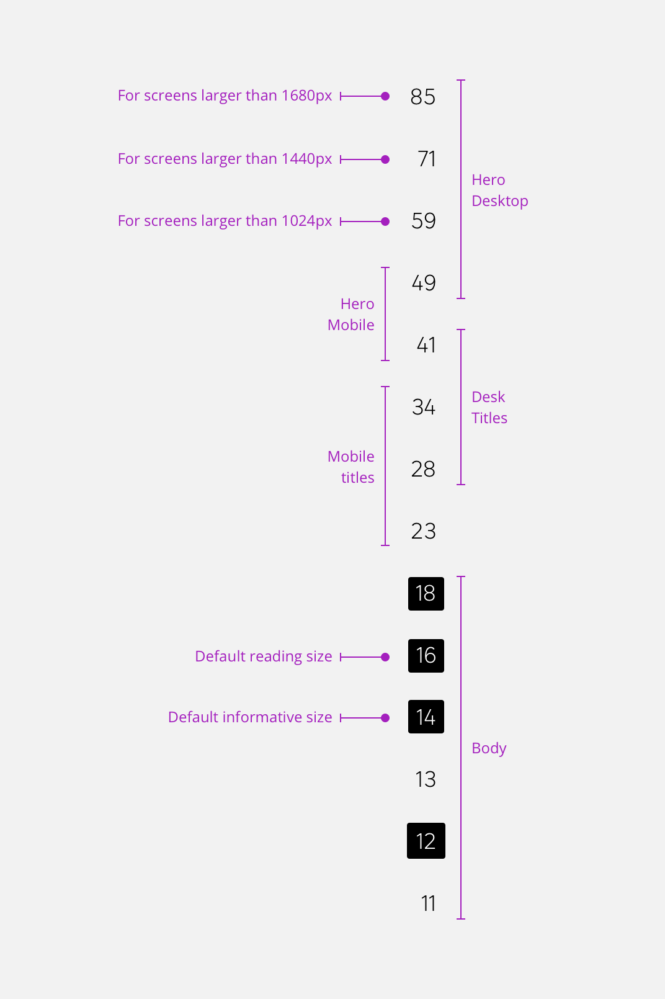
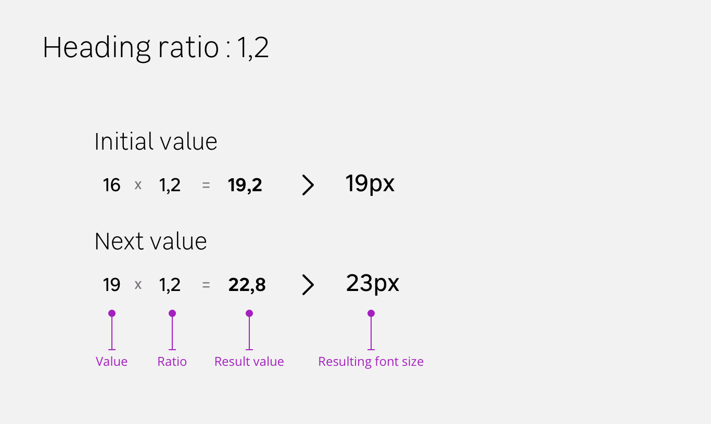
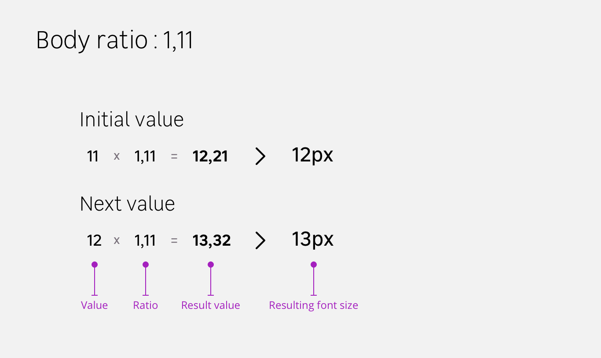
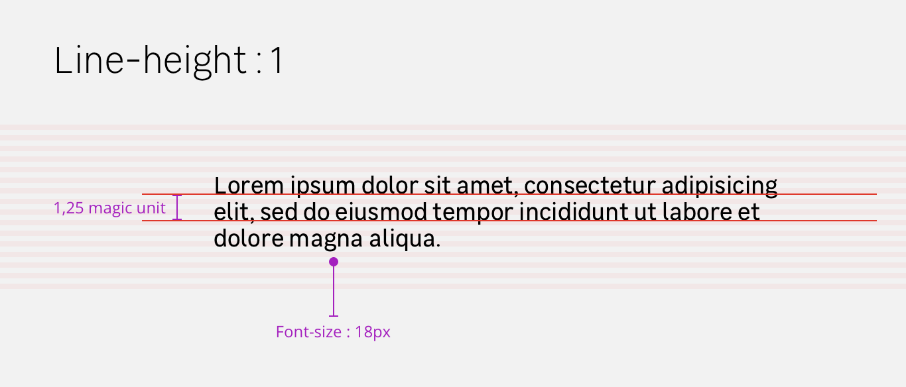
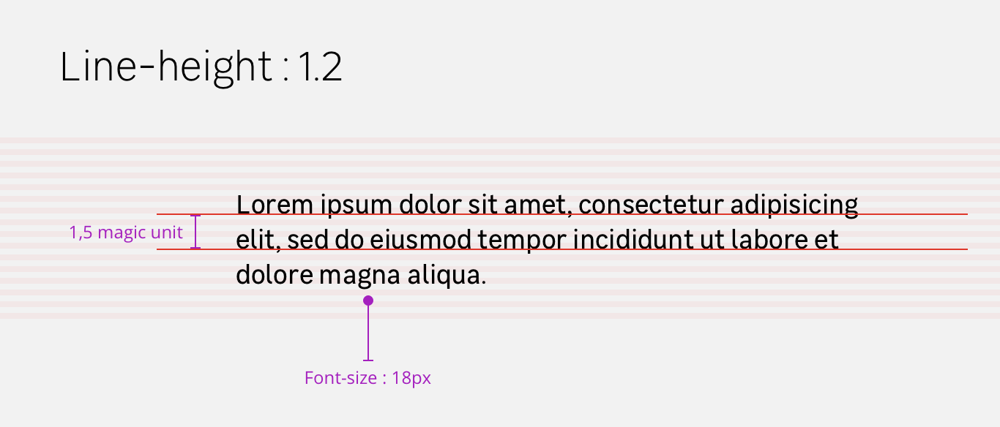
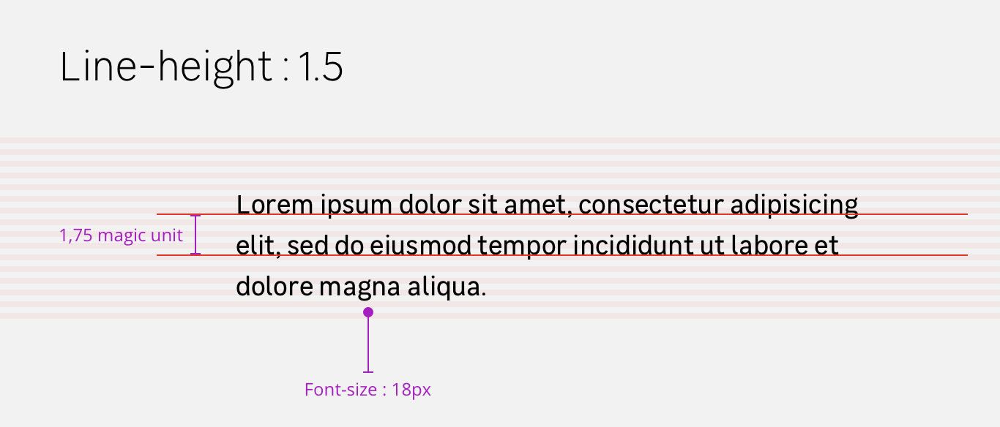
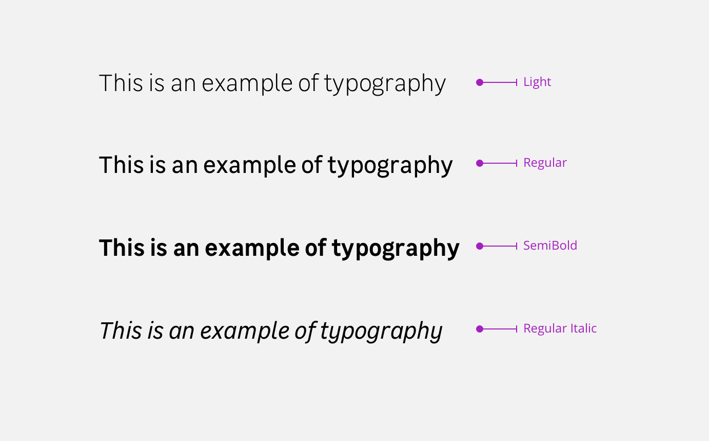

Fonts are used to create a visual hierarchy and to organise informations. It is the core of every design the team produces. This font system has been made to adapt to every device and every context.

# Global scale
We designed a global font size scale based on a default size called the Magic Unit.

# Two ratios
We have two ratio, heading and body ratios. Each scale is based on the magic unit.

# Line height ratios
The line height represents the space between the baseline of the letters in a text block. This line height has been calculated on magic unit basis. This magic unit is detailed here : _magic unit link_.

# Font weight
Font weight needs to be showed the same way across devices. It allows the team to create hierarchy between text elements and emphasise informations the right way.

# Font colors

## Text colors
Text colors don’t take the full color scale of our design system. We chose to use these values for text colors.

> Text colors visual

## Title colors
Like text colors, title colors don’t take the full color scale of our design system. We chose to use these values for title colors.

> Title colors visual
