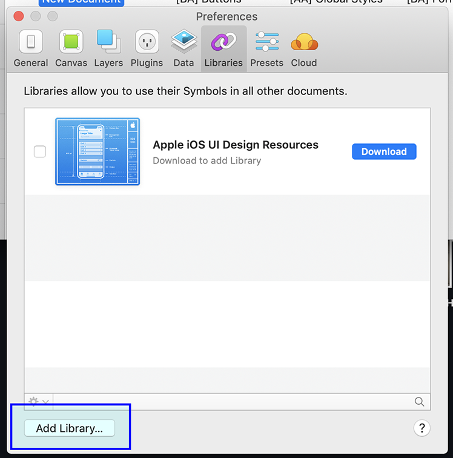
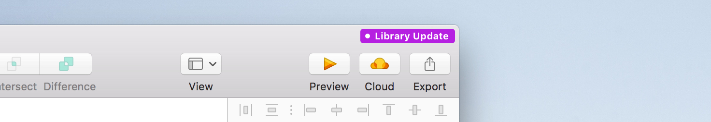

## Requirements

### Adeo Github access

1. [Join Adeo Github](https://adeo.github.io/join/) and follow the steps. 
   _You will have to create an account if you don't already have one_

### Sketch App - Version 53

All our patterns are currently designed on **Sketch**.  

[Download Sketch 53.](https://www.sketchapp.com/updates/#version-53)
 
 

#### Sketch plugins

It's required to use the **Anima app** plugin. 
 
We use it to add the following features to Sketch :

- Stack: Allow you to stack elements together, and to modify automatically their margin according to the height and width of the containing block.
- Padding : Allow you to generate paddings automatically.

[Download the Anima App plugin.](https://www.animaapp.com/layout)
 
 

## Design system libraries installation

The UI kit (Styles & components) consist of several files to use as sketch libraries.

### Download the design files

1. [Go there](https://github.com/adeo/design-system--design-files/) and follow the instructions to download the kit
2. Create a directory somewhere on your computer (or a server) and store the previously downloaded UI kit files in it (never store anything else in there)

### Import sketch files as libraries

1. Open Sketch and **go to Sketch’s Preferences** _[Command + Comma]_
2. Go to **"libraries"** tabs and click on the **"Add library..."** button.
3. Select all the files that are in the directory

 

### Update / use another version of UI kits

> Before making any file updates, please read the release notes. It may contain changes you do not have anticipated.

1. Download the [desired version](https://github.com/adeo/design-system--design-files/releases) of the UI kit
2. Replace all files in the directory you created with the newly downloaded ones
3. If new files are present in this version, you may have to add them as library as described in previous "import" section
4. Update your sketch files that uses the UI kit libraries by clicking the update button

---

## Next :

### [What's included ?](whatsIncluded/)

a comprehensive list of the content of **Garden** design files.
