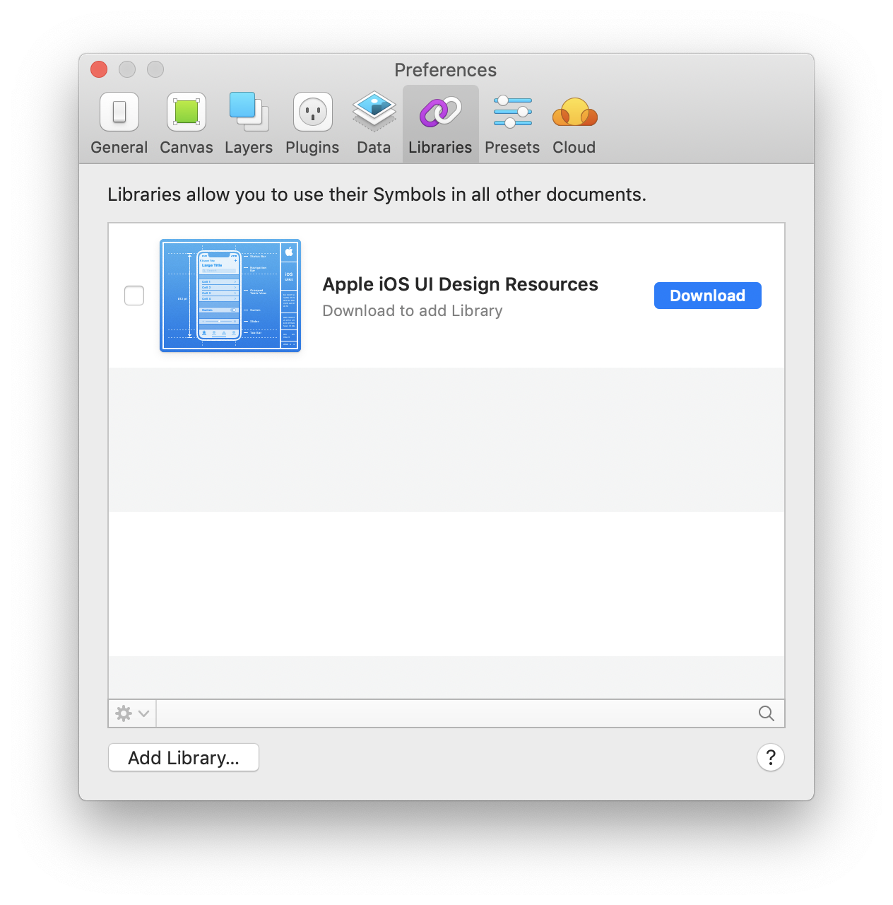

## Requirements
### Adeo Github access

1. [Join Adeo Github](https://adeo.github.io/join/) and follow the steps. 
_You will have to create an account if you don't already have one_
2. TODO - Add repository url

###Sketch App - Version 53

All our patterns are currently designed on **Sketch**.  
Styles & components consist of several files to use as libraries.

[Download Sketch 53.](https://www.sketchapp.com/updates/#version-53)
 
 
####Sketch plugins

It's required to use the **Anima app** plugin. 
 
We use it to add the following features to Sketch :
* Stack: Allow you to stack elements together, and to modify automatically their margin according to the height and width of the containing block.
* Padding : Allow you to generate paddings automatically.

[Download the Anima App plugin.](https://www.animaapp.com/layout)
 
 

## Design system libraries installation

### Download the design files

1. [Download the UI Kit here](https://github.com/adeo/design-system--design-files/)
2. Use a directory somewhere on your computer (or a server) to store the UI kit files (never store anything else in there)

### Import sketch files as libraries

1. Open Sketch and **go to Sketch’s Preferences** *[Command + Comma]*
2. Go to **"libraries"** tabs and click on the **"Add library..."** button.

  

 

### Update / use another version of UI kits

> Before making any file updates, please read the release notes. It may contain changes you do not anticipated.

1. Download the desired version of the UI kit
2. Replace all files in the directory you created for them
3. Update your sketch files with that use the UI kit libraries by clicking the update button

---

## Next :

### [What's included ?](whatsIncluded/)

a comprehensive list of the content of **Garden** design files.
