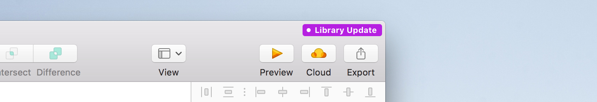

## 1. Download the design files

Go to the [UI Kit repository](https://github.com/adeo/design-system--design-files/) and follow the instructions to download the kit.

## 2. Create a dedicated directory

Create a directory somewhere on your computer (or a server) and store the previously downloaded UI kit files in it.
 
 
For better file management, we recommend that you follow these guidelines :

- Create your folder where it will not be moved by mistake.
- Never store anything else in the directory.

## 3. Import sketch files as libraries

1. Open Sketch and **go to Sketch’s Preferences** _[Command + Comma]_.
2. Go to **"libraries"** tabs and click on the **"Add library..."** button.
3. Select all the files that are in the directory.

 

## 4. Update / Use another version of UI kits

> Before making any file updates, please read the release notes. It may contain changes you do not have anticipated.

1. Download the [desired version](https://github.com/adeo/design-system--design-files/releases) of the UI kit.
2. Replace all files in the directory you created with the newly downloaded ones.
3. If new files are present in this version, you may have to add them as library as described in previous "import" section.
4. Update your sketch files that uses the UI kit libraries by clicking the update button.

