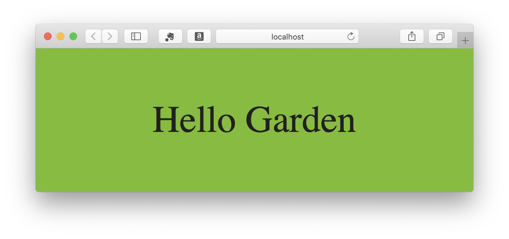
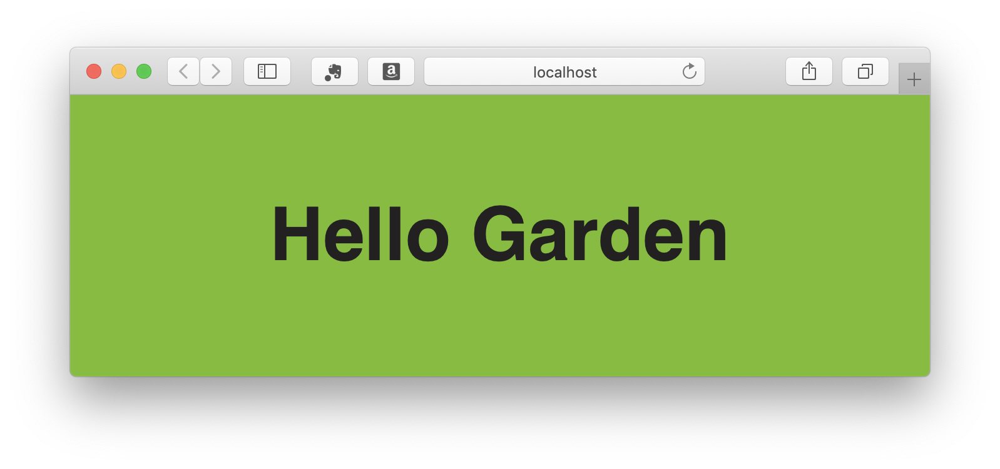

# Configure your development environment

**Follow this short tutorial to be up and running with Garden in a small new project**

You have read the presentation tab and followed the installation steps (or [you should](/getStarted/developers/)).

Now you should have :

- a brand new project directory
- node 10+ installed
- a `package.json` file with garden installed

## I) Install and configure PostCSS

Configuring Postcss is always done by providing an array of plugins.
Garden provide you with this array of postcss plugins, but no task runner comes with it.

That way, you are free to use your favorite one, like gulp, grunt, webpack or even npm scripts.

For this tutorial, we will use npm scripts and some npm package as simple exemple.

### A) Install postcss-cli :

```shell
npm install --save postcss-cli
```

### B) Configure PostCSS :

Create a postcss.config.js file in your project root directory and paste the following code inside :

```js
const pluginList = require('garden-css/cssCompiler/postcssPluginConfig')

module.exports = {
  plugins: pluginList,
}
```

### C) Create some files :

Create `src/` and `dist/` directories.

Create a `src/bundle.scss` file and paste the following code :

```scss
@import '../../node_modules/garden-css/styles/settings-tools/_all-settings';

body {
  @include font-scale('12', 's');

  background-color: $color-primary-01-500;
  color: $color-font-darker;
  text-align: center;
  margin: 0;
  padding: $mu500;
}
```

your project should look like this now :

```
my-project/
├── src/
│   ├── bundle.scss
├── dist/
│   ├── (empty: generated files will go there)
├── package.json
├── postcss.config.js
```

### D) Add scripts to build and watch your css :

create the following npm scripts under the script keys in your package.json file.

```json
"scripts": {
  "css:build": "npx postcss src/bundle.scss --output dist/bundle.css",
  "css:watch": "npx postcss src/bundle.scss --output dist/bundle.css --watch"
},
```

`css:build` tell `postcss-cli` to build our SCSS and to output the compiled CSS files into the `dist/` directory.
We also created a `css:watch` command to watch our changes to the scss files.

### E) Run the watcher :

```shell
npm run css:watch
```

Now each time you make a change, the `dist/bundle.css` file is updated. Postcss also create a `dist/bundle.css.map` witch will alow you to determine the source file and line of a declaration in the browser inspector.

Postcss is up and running 😝 !!!

## II) It's time to write some CSS !

### Stylelint to lint SCSS files :

Stylint comes with its configuration in garden and it is provided at compilation time. You don't necessarily need a root config file, but in some case you may want to have it, for exemple to configure prettier-stylelint on your IDE, or to use stylelint outside of the compilation pipeline.

In that case you can create a `stylelint.config.js` file in the root dir of your project.

As an exemple, we will create a npm script that will fix the syntax in our SCSS files.

### A) Create a npm fix command :

let's create a npm script to fix our stylelint errors, add the following in your `package.json` :

```json
"scripts": {
  "css:build": "npx postcss src/bundle.scss --output dist/bundle.css",
  "css:watch": "npx postcss src/bundle.scss --output dist/bundle.css --watch",
  "css:lint-fix": "npx stylelint src/*.scss --fix"
},
```

> note that there is so much that stylelint --fix can do. You will still need to fix some styling issues manually

If you try to run the `npm run css:lint-fix` command, node will throw an error because **stylelint require a config file**.

**Garden** export a stylelint config, so we all can use the same codding styles.

### B) Create a stylint config file :

Create a `stylelint.config.js` file at your project root.

then edit the file and add the folowing code :

```js
module.exports = require('garden-css/cssCompiler/styleLintConfig.js')
```

Run the `npm run css:lint-fix` command. Nothing should appen, because the code you copied as no error (let's hope).

### C) Let's test that :

Edit your `bundle.css` file, and edit line 5 to remove the line break betwen the mixin instanciation and the first declaration :

```scss
@import '../../node_modules/garden-css/styles/settings-tools/_all-settings';

body {
  @include font-scale('12', 's');
  background-color: $color-primary-01-500;
  color: $color-font-darker;
  text-align: center;
  margin: 0;
  padding: $mu500;
}
```

Run the `npm run css:lint-fix` again. Stylint fixed this outrageous mistake and added the line break after the mixin instanciation.

et voilà !

## III) Static assets :

**Garden provide you with static assets like fonts, icons or logos.**

Depending on your env, statics assets likes icons or fonts may be served from a diferent URL.

let's create **a live-reloading dev server** as an exemple.

### A) Copy the statics :

Let's make a script that will clean our `dist/statics/` directory and copy the static assets from the garden `nodes_module` to our project.
that way, we will be sure that we always have the last version of thoses static assets in our project.

Add in your package.json the following script :

```json
"scripts": {
    ...
    "statics:copy": "rm -rf dist/static && cp -r node_modules/garden-css/static dist/static"
},
```

### B) Create a dev server :

first let's install `live-server`

```shell
npm install live-server --save-dev
```

And create a scritp to lunch it upon our `dist/` directory. We will tell it to refresh the browser whenever there is a change in the dist directory, and also to run the `statics:copy` command before starting.

```json
"scripts": {
    ...
    "serve": "npm run statics:copy && npx serve dist/"
},
```

### C) Hello garden :

create an `index.html` file in the `dist` directory

paste the following inside :

```html
<!DOCTYPE html>
<html>
  <head>
    <meta charset="utf-8" />
    <title>Garden Test</title>
    <link rel="stylesheet" type="text/css" media="screen" href="bundle.css" />
  </head>
  <body>
    Hello Garden
  </body>
</html>
```

now run `npm run serve`. Live server should open your favorite browser.

you should now see something like this :



Change 'Hello Garden' for 'Hello foo' in your `index.html`and save. Your browser should refresh atomatically.

### D) Use the Garden Fonts

When starting your server, the fonts should have been added into `dist/static/fonts` directory.

But as you can see, the fonts are not the garden ones. Let's configure that :

open a new terminal window at your project dir and run the css wtacher

```bash
npm run css:watch
```

in the `src/bundle.scss` file add the folowing :

```scss
$font-path: 'static/fonts';

@import '../../node_modules/garden-css/styles/settings-tools/_all-settings';

body {
  @include font-face('semi-bold');
  @include font-scale('12', 's');

  background-color: $color-primary-01-500;
  color: $color-font-darker;
  text-align: center;
  margin: 0;
  padding: $mu500;
}
```

your browser should now look like this :



# Notes

> Note that you may only want to compile exisiting Garden components. In that case, you just have to create your own bundle, and import the parts you are interested in :

```scss
// mandatory
@import '../../node_modules/garden-css/styles/settings-tools/_all-settings';

// your components
@import '../../node_modules/garden-css/styles/layout/_l.grid';
@import '../../node_modules/garden-css/styles/atoms/_a.button';
@import '../../node_modules/garden-css/styles/molecule/_m.button';
```

note that you need to follow the ITCSS/ADS [import order](https://gael-boyenval.gitbook.io/atomic-design-css-architecture-with-itcss-bem-sass/principles/unifying-itcss-with-ads#summarize-the-new-architecture)

### If you want to create your own local components :

Note that if you want to pipe your own components into the same as the garden ones, the linter will ask of you to follow our guidelines.

Please read [our guidelines](https://gael-boyenval.gitbook.io/atomic-design-css-architecture-with-itcss-bem-sass/) to write CSS that follows our conventions.

If you choose not to follow our guideline, build your CSS appart from the garden ones with the tool of your choice.
