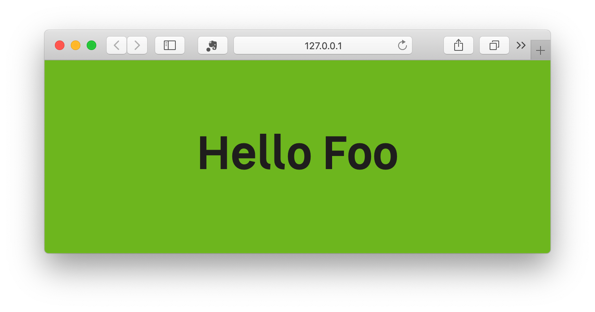

# Configure your development environment

After installing the npm dependency, here some guidelines to configure your project environement.

## Install and configure PostCSS

Configuring Postcss is always done by providing an array of plugins.
Garden provide you with this array of postcss plugins, but no task runner comes with it.

That way, you are free to use your favorite one, like gulp, grunt, webpack or even npm scripts.

### A simple setup exemple using npm script and postcss-cli :

```shell
npm install --save postcss-cli
```

#### create a postcss.config.js :

```js
const pluginList = require('garden-css/cssCompiler/postcssPluginConfig')

module.exports = {
  plugins: pluginList,
}
```

#### create src and dist directories, and add your first bundle :

create a `src/bundle.scss` file and paste the following :

```scss
// we will find a better way to include those
@import '../../node_modules/garden-css/styles/settings-tools/_all-settings';

body {
  @include font-scale('12', 's');

  background-color: $color-primary-01-500;
  color: $color-font-darker;
  text-align: center;
  margin: 0;
  padding: $mu500;
}
```

your project should look like that :

```
my-project/
├── src/
│   ├── bundle.scss
├── dist/
│   ├── (generated files will go there)
├── package.json
├── postcss.config.js
```

#### Then, add some scripts to your package.json :

```json
"scripts": {
  "css:build": "npx postcss src/bundle.scss --output dist/bundle.css",
  "css:watch": "npx postcss src/bundle.scss --output dist/bundle.css --watch",
},
```

### run the build :

```shell
npm run css:watch
```

you are up and running 😝 !!!

## Writing SCSS

Note that you may only want to compile exisiting Garden components. In that case, you just have to create your own bundle, and import the parts you are interested in :

```scss
// mandatory
@import '../../node_modules/garden-css/styles/settings-tools/_all-settings';

// your components
@import '../../node_modules/garden-css/styles/layout/_l.grid';
@import '../../node_modules/garden-css/styles/atoms/_a.button';
@import '../../node_modules/garden-css/styles/molecule/_m.button';
```

note that you need to follow the ITCSS/ADS [import order](https://gael-boyenval.gitbook.io/atomic-design-css-architecture-with-itcss-bem-sass/principles/unifying-itcss-with-ads#summarize-the-new-architecture)

### If you want to create your own local components :

Note that if you want to pipe your own components into the same as the garden ones, the linter will ask of you to follow our guidelines.

Please read [our guidelines](https://gael-boyenval.gitbook.io/atomic-design-css-architecture-with-itcss-bem-sass/) to write CSS that follows our conventions.

If you choose not to follow our guideline, build your CSS appart from the garden ones with the tool of your choice.

## configuring stylelint :

Stylint comes with its configuration in garden and it is provided at compilation time. You don't necessarily need a root config file, but in some case you may want to have it, for exemple to configure prettier-stylelint on your IDE, or to use stylelint outside of the compilation pipeline.

in that case you can create a `stylelint.config.js` file in the root dir of your project

### the css:lint-fix example :

let's create a npm script to fix our stylelint errors, add the following in your `package.json` :

```json
"scripts": {
  "css:build": "npx postcss src/bundle.scss --output dist/bundle.css",
  "css:watch": "npx postcss src/bundle.scss --output dist/bundle.css --watch",
  "css:lint-fix": "npx stylelint src/scss/*.scss --fix"
},
```

If you try to run the `npm run css:lint-fix` command, node will throw an error because it require a config file.

let's create it :

```shell
touch stylelint.config.js
```

then edit the file and add the folowing code :

```js
module.exports = require('garden-css/cssCompiler/styleLintConfig.js')
```

# Static assets configuration :

depending on your env, statics assets likes icons or fonts may be served from a diferent URL.

let's create an exemple,

we want to serve our fonts and an index file using serve :

```shell
npm install serve --save-dev
```

package.json :

```json
"scripts": {
    ...
    "statics:copy": "rm -rf dist/static && cp -r node_modules/garden-css/static dist/static",
    "serve": "npm run statics:copy && npx serve dist/"
},
```

what we've done here is to create a task that copy assets from the `garden-css` static directory to our dist directory.
then we created a task that serve our dist directory

create an `index.html` file in the `dist` directory

```shell
touch dist/index.html
```

paste the following inside :

```html
<!DOCTYPE html>
<html>
  <head>
    <meta charset="utf-8" />
    <title>Garden Test</title>
    <link rel="stylesheet" type="text/css" media="screen" href="bundle.css" />
  </head>
  <body>
    Hello Garden
  </body>
</html>
```

now run `npm run serve`, and go to the localhost url provided by serve.

you should now see something like this :


But as you can see, the fonts are not the garden ones. Let's configure that :

in the `src/bundle.scss` file add the folowing :

```scss
// insert it before tbe settings
$font-path: 'static/fonts';

@import '../../node_modules/garden-css/styles/settings-tools/_all-settings';

body {
  @include font-face('semi-bold');
  @include font-scale('12', 's');

  background-color: $color-primary-01-500;
  color: $color-font-darker;
  text-align: center;
  margin: 0;
  padding: $mu500;
}
```

build your scss, serve once more and open your browser :


