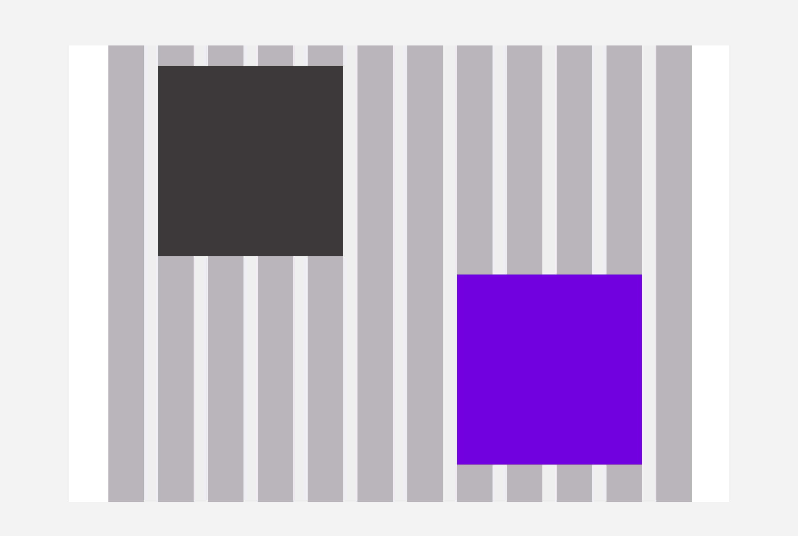

# Overview
A grid is a division of a page based on 3 elements :
* Columns - helps to position elements vertically
* Gutters - the space between each columns
* Margins - the space between the container and the edges of the page

A grid is used to create a **more structured and more harmonious design.** It’s the framework of your page, you build the layout by placing blocks of contents (text, images,…) on a certain number of columns.
Gutters are used to separate 2 blocks, they give air to the design.
Columns and gutters form a container. The container can be **full width or with a fixed size.**

A grid adapts itself according to the device it is used on. The width of the columns and the gutters evolve. The breakpoint defines the moment when the grid changes to **adapt itself to the device.** Each device has its own breakpoint.

Grids speed up the designer-to-developer workflow by allowing developers to pre-set classes in their code that correspond to column sizes.

# Principles
When using a grid, you decide the size of your elements by **the number of columns they use.** An element should always stand on one or between several columns, it can’t start on a gutter.

Elements can be separated by gutters or by a combination of columns and gutters.

# Best practices
We work with **12-columns grids** because the number 12 is the most versatile. 12 is divisible among reasonably small numbers ; it’s possible to have 12, 6, 4, 3, 2 or 1 evenly spaced columns. This gives designers a lot of flexibility when they create a layout.
The width of our **gutters has to be a multiple of our Magic Unit,** incremented by 0.5 : it can be 1.5 MU, 2 MU, but not 0.25 MU.

# Structure

Here is our different grid sizes :

##### Breakpoint - 1401 and more (Desktop)

| Number of colums | Container width | Column width | Gutter width | Margins |
|:----------------:|:---------------:|:------------:|:------------:|:-------:|
|        12        |      1300px     |     79px     |     32px     |    0    |

 

##### Breakpoint - 1201px to 1400px (Desktop)

| Number of colums | Container width | Column width | Gutter width | Margins |
|:----------------:|:---------------:|:------------:|:------------:|:-------:|
|        12        |      1144px     |     66px     |     32px     |    0    |

 

##### Breakpoint - 993px to 1200px (Desktop and Tablet)

| Number of colums | Container width | Column width | Gutter width | Margins |
|:----------------:|:---------------:|:------------:|:------------:|:-------:|
|        12        |       964px     |     51px     |    32px     |     0    |

 

##### Breakpoint - 750px to 992px (Tablet)

| Number of colums | Container width |         Column width         | Gutter width | Margins |
|:----------------:|:---------------:|:----------------------------:|:------------:|:-------:|
|        12        |       100%      | Varies based on screen width |     32px     |   16px  |

 

##### Breakpoint - 749px and less (Mobile)

| Number of colums | Container width |         Column width         | Gutter width | Margins |
|:----------------:|:---------------:|:----------------------------:|:------------:|:-------:|
|        12        |       100%      | Varies based on screen width |     16px     |   16px  |
