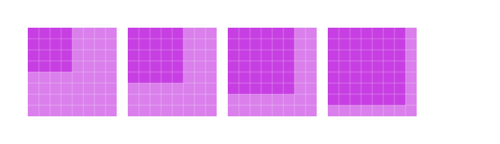

# What is the magic unit ?
The magic unit is the base unit for every thing that have a dimension. 
It's equal to 16px.

# How to use it?
The level of granularity that can be use depend of the size.

## Less than 2 MagicUnit

level of granularity : Quarter

## >2 <4 MagicUnit

level of granularity :Half

## >4 MagicUnit

level of granularity : Plain

It mean that you can use dimension of 4px, 8px, 12px, ...

