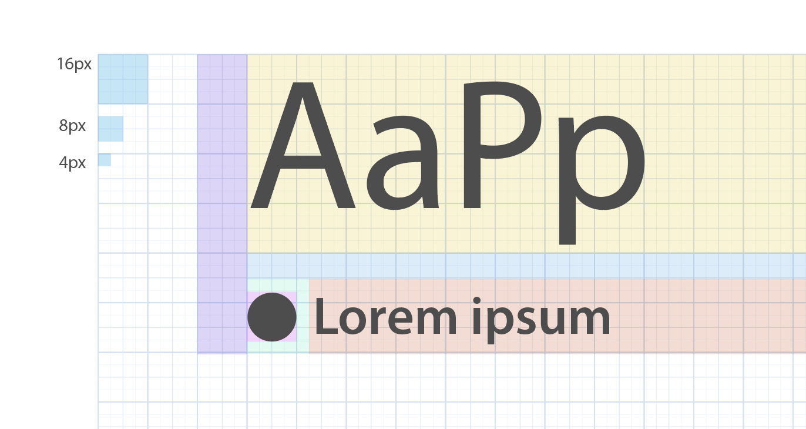

### What is the magic unit ?

The magic unit is a very low level constant used to manage a consistant scale trough a product.
This constant will be used everywhere in the source code.

This "magic unit" is refering to a **16px font-size**. This is the standard body font-size used by Garden.

### Why do we use the magic unit ?

Using a magic unit have multiples benefits.

- It make the overall compositions feels more harmonious and organised.
- It create a sens of vertical rythm
- It help create consistant sized elements
- Therefore it improve modularity, and reusability
- It help reduce the gziped css bundle sile

### What should I use it for ?

You should use the magic unit as often as you can in order to create this feeling of vertical and horizontal rythm.

By using it for line-heights, spaces, icons sizes and everywhere you can, you will virtually snap elements to a baseline vertical grid.

As 16px is quite a big value, and in order to have a more subtle control over spaces you can divide this unit in alf or quarters. `MagicUnit / 4` or `MagicUnit x 0.25`
under this factor we consider this as fine tunning and you may use any value in px or rem you choose.

<hint type="dont" content-type="css" title="Do not use less than 0.25 Magic Unit increments">
.my-class {
  margin-left: $MagicUnit * 0.123;
  width: $MagicUnit * 10.325
}
</hint>

<hint type="do" content-type="css" title="You can still use px for fine-tunning">
.my-class {
  margin-left: $MagicUnit * 0.25; // === $MagicUnit/4 === 4px
  margin-right: 3px; // fine tunning with px is okay when required
  width: $MagicUnit * 10.5; // 168px
}
</hint>
