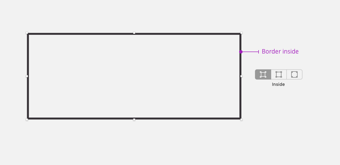

# Overview
Strokes are visual elements that space and structure contents.

# Principles

### Components
Always set **borders inside** with **squared ends** for any component.

### Icons
Icons use different rules : link  
Different border thickness are used to create a hierarchy.

# Structure
There are **three different thickness levels** : 1px, 2px and 3px.  
1px and 2px thickness borders are used for components.
Icons use 1px, 2px and 3px border thickness.

# Token
To be defined
